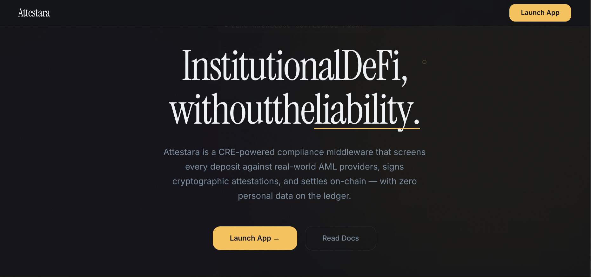
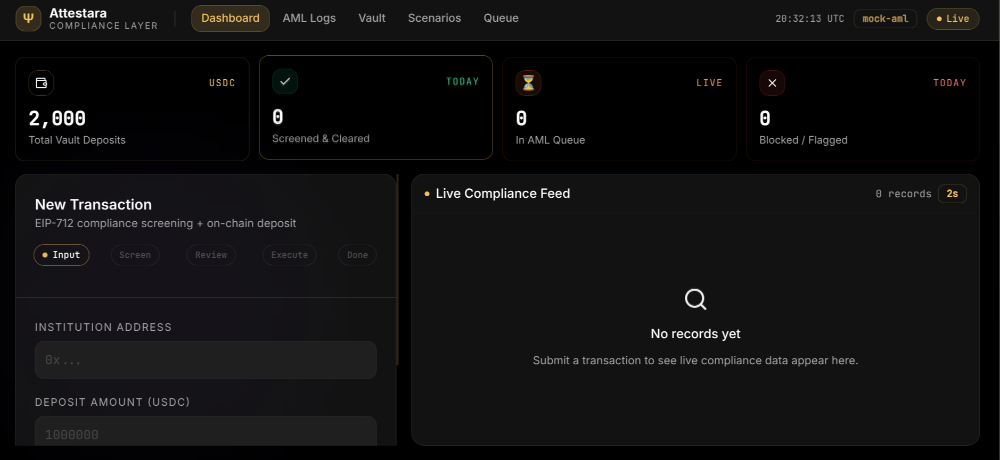

<div align="center">

# Ψ Attestara

**A CRE-orchestrated compliance layer for institutional DeFi**

*AI-powered AML screening · EIP-712 attestations · Zero on-chain exposure*

---

[](https://www.typescriptlang.org/)
[](https://soliditylang.org/)
[](https://tenderly.co/)
[](LICENSE)

</div>

---

## Overview

**Attestara** is a CRE-orchestrated compliance layer for institutional DeFi — a production-pattern middleware stack that sits between institutions and a permissioned vault. It enforces real-time AML/KYC compliance without ever writing personal data on-chain — only cryptographic commitments.

```
Institution Wallet
       │
       ▼
┌──────────────────────┐
│  CRE Engine :4000    │  ← Compliance & Routing Engine (off-chain enclave)
│  ┌────────────────┐  │
│  │ AI AML Oracle  │──┼──► Etherscan API + Gemini AI (primary)
│  │ Mock AML       │──┼──► Mock AML Server (fallback)
│  │ EIP-712 Sign   │  │
│  │ Tx Simulation  │──┼──► Tenderly Simulation API
│  │ Trace Analysis │──┼──► Tenderly Transaction API
│  └────────────────┘  │
└──────────────────────┘
       │
       ▼
┌──────────────────────┐
│  PermissionedVault   │  ← On-chain (Tenderly Virtual TestNet)
│  ┌────────────────┐  │
│  │ DIDRegistry    │  │
│  │ Attestation    │  │
│  │ Verifier       │  │
│  └────────────────┘  │
└──────────────────────┘
```

**Privacy model:** AML reports never touch the chain. The CRE signs a `ComplianceAttestation` struct containing only a `keccak256` hash of the report + the subject address. The vault verifies the signature on-chain. No PII, ever.

---

## Screenshots

### Landing Page


> **https://attestara-frontend.vercel.app/** — Marketing landing page with animated architecture flow, privacy model, adversarial scenario showcase, and live demo preview.

### Compliance Dashboard


> **https://attestara-frontend.vercel.app/app** — Full compliance dashboard with TransactionStepper, AML Logs, Vault Stats, Scenarios tab, and Gas Analysis.

---

## Glossary

New to institutional DeFi compliance? Here's what every term in this project means.

| Term | What it means |
|---|---|
| **CRE** | *Compliance & Routing Engine* — the off-chain middleware service at the heart of Attestara. It runs AML checks, signs attestations, and relays transactions. Think of it as a compliance firewall between an institution and the vault. |
| **AML** | *Anti-Money Laundering* — the regulatory process of screening wallets and transactions to detect illegal activity. In Attestara, AML screening runs inside the CRE using Chainalysis KYT or the built-in mock server. |
| **KYT** | *Know Your Transaction* — Chainalysis's real-time transaction risk scoring API. It analyses counterparty exposure, mixer usage, OFAC sanctions, and more. Attestara abstracts KYT behind a pluggable adapter. |
| **OFAC** | *Office of Foreign Assets Control* — the US Treasury body that maintains sanctions lists. Wallets on OFAC lists are flagged `BLOCKED` by the AML screener. |
| **DID** | *Decentralized Identifier* — a globally unique identifier (e.g. `did:ethr:0xABC...`) anchored to a blockchain address instead of a central authority. In Attestara, every institution must register a DID in the on-chain `DIDRegistry` before they can deposit. This proves they have gone through onboarding. |
| **DID Registry** | The `DIDRegistry.sol` smart contract that maps Ethereum addresses to DID documents. A DID document contains a document hash, service endpoint, and timestamps. The vault checks this registry before accepting any deposit. |
| **EIP-712** | An Ethereum standard for hashing and signing structured data (not raw bytes). Attestara uses EIP-712 to sign `ComplianceAttestation` structs — this means wallets show a human-readable signing prompt instead of a raw hex blob, and the signature is domain-separated to prevent cross-contract replay. |
| **Attestation** | A signed statement issued by the CRE that says "I checked this address against AML rules and it passed." It contains the subject address, an AML report hash, an expiry timestamp, and a one-time nonce. The vault verifies this on-chain before accepting a deposit. |
| **Nonce** | A one-time random number embedded in each attestation. Once an attestation is used in a deposit, its nonce is permanently recorded as spent in the `ComplianceAttestationVerifier` contract. This prevents the same attestation being replayed to make a second deposit. |
| **TTL** | *Time To Live* — the validity window of a signed attestation, defaulting to 15 minutes. After expiry, the vault rejects the deposit with `Attestation__Expired`. This limits the window in which a compromised attestation could be misused. |
| **Tenderly** | A blockchain development platform used by Attestara for four things: (1) hosting a **Virtual Sepolia TestNet**, (2) simulating transactions before execution, (3) providing execution traces for gas analysis, and (4) firing webhooks when specific contract calls are detected. Contracts deployed to Tenderly Virtual TestNets are **automatically verified** via the `@tenderly/hardhat-tenderly` plugin. |
| **Virtual TestNet / Fork** | A sandboxed copy of Sepolia testnet state hosted by Tenderly (`chainId: 11155111`). Transactions are isolated and free (funded with VETH via `tenderly_setBalance`). Attestara deploys to a Virtual Sepolia fork so you can run the full stack without spending real ETH. |
| **Simulation** | Tenderly's ability to execute a transaction against fork state without mining it. Attestara uses this as a pre-flight check — if the deposit would revert, the user sees the decoded reason before any gas is spent. |
| **ERC-20** | The standard interface for fungible tokens on Ethereum. Attestara uses USDC (a stablecoin pegged to $1) as the deposit asset. USDC implements ERC-20, so the vault calls `approve` + `transferFrom` to pull funds. |
| **ERC-4626** | A standard for tokenized vaults (yield-bearing deposit contracts). `PermissionedVault.sol` follows the spirit of ERC-4626 but adds a mandatory compliance gate before each deposit. |
| **ECDSA** | *Elliptic Curve Digital Signature Algorithm* — the cryptographic primitive Ethereum uses for transaction signing. The CRE's EIP-712 attestation signature is an ECDSA signature recovered by the `ComplianceAttestationVerifier` contract to prove the CRE authorised the deposit. |
| **Relay / Relayer** | A pattern where a backend service (the CRE) submits an on-chain transaction on behalf of a user, so the user doesn't need ETH for gas. In Attestara's demo mode, the CRE relays the vault deposit using the institution's private key passed in the request body. |
| **Revert** | When a smart contract transaction fails and all state changes are rolled back. Attestara's contracts use custom errors (`Vault__Paused`, `Attestation__NonceUsed`, etc.) that are decoded by the simulation service into human-readable messages. |
| **State Manipulation** | Tenderly's RPC extensions (`tenderly_setBalance`, `tenderly_setStorageAt`, `evm_increaseTime`) that let you directly modify fork state — useful for scripting test scenarios like advancing time past attestation expiry or funding a wallet with USDC without going through an exchange. |
| **Tenderly Alerts / Webhooks** | Tenderly can watch for specific on-chain events (e.g. a call to `PermissionedVault.deposit()`) and fire an HTTP POST to a CRE endpoint in real time. Attestara uses this for Feature 3: revocation — the CRE re-screens an address the moment a deposit is detected and can burn the nonce before it settles. |
| **Gas** | The unit of computational work in Ethereum. Every operation (storage write, signature verification, token transfer) costs gas, priced in gwei (1 gwei = 10⁻⁹ ETH). Attestara's gas dashboard decomposes a deposit's total gas into per-call-frame costs so you know exactly what each compliance check costs. |
| **keccak256** | Ethereum's standard hash function (a variant of SHA-3). Attestara uses it to commit to AML reports on-chain: `amlReportHash = keccak256(reportJSON)`. The report itself stays off-chain; only the hash is stored in the attestation. |
| **USDC** | *USD Coin* — a fiat-backed stablecoin issued by Circle, pegged 1:1 to the US dollar. It's the deposit asset in Attestara's vault because institutional DeFi typically operates in dollar-denominated stablecoins rather than volatile assets. |
| **Aave Arc** | An institutional-grade, permissioned version of the Aave lending protocol. It uses a `PermissionManager` whitelist to gate deposits. Attestara's vault is inspired by Aave Arc but replaces the static whitelist with a dynamic, per-transaction CRE attestation. |
| **EIP-712 Domain Separator** | A hash that uniquely identifies a specific contract deployment (by name, version, chain ID, and contract address). It prevents a signature intended for Attestara's verifier on mainnet being replayed against a different verifier on another chain or contract. |

---

## Features

### Core Compliance Pipeline
- **DID Resolution** — institutions register on-chain Decentralized Identifiers via `DIDRegistry.sol`
- **AI-Powered AML Screening** — wallet transaction history analysed by Gemini AI via Etherscan data (with fallback to mock/Chainalysis adapters)
- **EIP-712 Attestations** — CRE signs typed-data attestations with a 15-minute TTL and one-time nonces
- **Relay Mode** — CRE can relay the full deposit transaction on behalf of the institution

### Feature 6 — AI Compliance Oracle (Etherscan + Gemini AI)
> *"Let AI analyze 50 transactions in 2 seconds instead of a human reviewing for days"*

The CRE's **AI AML Adapter** replaces traditional rule-based screening with intelligent wallet analysis:

1. **Etherscan** — fetches the last 50 transactions + token transfers for the wallet (free API)
2. **Gemini AI** — sends a structured prompt with tx summary, counterparty analysis, and known protocol detection
3. **AI produces** a risk score (0–100), alert codes, and a **natural-language narrative** explaining the assessment
4. **Fallback** — if APIs are unreachable, static mock rules still work (demo hint pills remain functional)

```
Screen Request → Etherscan (tx history) → Gemini AI (risk analysis) → AMLScreeningResult + AI Narrative
```

The AI narrative appears in the frontend as a purple **🧠 AI Risk Analysis** card:
- **ScreenForm** — after the screening result badge
- **TransactionStepper** — in the attestation review step
- **AML Logs** — 🧠 tooltip on rows screened by AI

**Adapter priority:** `AI Oracle` > `Chainalysis KYT` > `Mock AML` (set by environment variables)

### Feature 1 — Tenderly Simulation Pre-Flight
> *"Predict the future before committing to it"*

Before executing any deposit on-chain, the CRE sends the full calldata to **Tenderly's Simulation API**. If the transaction would revert, the institution sees a decoded human-readable reason (`Vault__DIDNotRegistered`, `Attestation__Expired`, etc.) — zero gas wasted.

```
Screen → Sign → 🔮 Simulate (Tenderly) → Preview → Execute on-chain
```

The deposit response includes a `simulation` object:
```json
{
  "success": true,
  "gasUsed": 185432,
  "gasEstimateUsd": "2.31",
  "preview": {
    "gasLabel": "~185,432 gas ($2.31)",
    "stateChanges": ["Vault balance increases by 1,000 USDC"],
    "events": ["✅ AttestationVerified", "✅ Deposit"]
  }
}
```

### Feature 2 — Time-Travel Compliance Auditing
> *"Was this address compliant at the time of the deposit 3 months ago?"*

The CRE creates an **ephemeral Tenderly fork pinned to the exact block** of a historical deposit and re-queries all on-chain compliance state — DID registration, nonce consumption, vault balance — then compares it with the current state.

```
GET /api/v1/compliance/audit/:txHash
```

Returns a side-by-side comparison:

| Field | At Deposit (Block #18500000) | Now |
|---|---|---|
| DID Registered | ✅ did:ethr:0xABC… | ✅ Same |
| Vault Balance | 50,000 USDC | 120,000 USDC |
| Nonce Consumed | ✅ First use | ✅ Consumed |

The ephemeral fork is automatically torn down after the query.

### Feature 3 — Real-Time Attestation Revocation
> *"The AML status changed in the 15-minute window — revoke before settlement"*

Tenderly Alerts fire a webhook to the CRE when a vault deposit is detected. The CRE immediately re-screens the address. If the status changed to `BLOCKED` or `HIGH_RISK`, it burns the attestation nonce on-chain via `tenderly_setStorageAt` — causing the deposit to revert with `Attestation__NonceUsed`.

```
POST /api/v1/webhooks/tenderly   ← Tenderly Alert webhook receiver
POST /api/v1/compliance/revoke   ← Manual revocation trigger
GET  /api/v1/revocations         ← Revocation event log
```

### Feature 4 — Adversarial Scenario Playground
> *"Prove every revert path works — on demand, one click"*

Five scripted security scenarios using Tenderly state manipulation (`evm_increaseTime`, `tenderly_setBalance`, `tenderly_setErc20Balance`, `tenderly_setStorageAt`):

| Scenario | What it proves |
|---|---|
| 🚫 **Sanctioned Address** | CRE blocks OFAC-listed addresses before any on-chain interaction |
| 🔁 **Replay Attack** | `Attestation__NonceUsed` — signed attestations can only be used once |
| ⏰ **Expired Attestation** | `Attestation__Expired` — 15-minute TTL is enforced on-chain |
| 🪪 **Unregistered DID** | `Vault__DIDNotRegistered` — AML clearance alone is not sufficient |
| ⏸️ **Emergency Vault Pause** | `Vault__Paused` — owner kill-switch blocks all deposits instantly |

```
POST /api/v1/scenarios/:scenarioId
# scenarioId: sanctioned | replay | expired | no-did | pause
```

### Feature 5 — Gas Optimization Dashboard
> *"Where exactly is each wei being spent?"*

After every deposit, the CRE fetches the **Tenderly Transaction Trace** and decomposes gas into a structured call-tree with per-node percentages and category totals.

```
GET /api/v1/vault/trace/:txHash
```

```
PermissionedVault.deposit()              185,432 gas  100%
├── DIDRegistry.isRegistered()             8,500 gas    4.6%
├── ComplianceAttestationVerifier.verify() 52,100 gas  28.1%
│   ├── ECDSA.recover()                    3,800 gas    2.1%
│   ├── EIP712._hashTypedDataV4()          6,200 gas    3.4%
│   └── Storage: usedNonces write         20,000 gas   10.8%
├── SafeERC20.safeTransferFrom()          45,000 gas   24.3%
├── DIDRegistry.resolve()                 12,000 gas    6.5%
└── Storage: balances + totalDeposits    40,000 gas   21.6%
```

Includes optimization hints and rolling session averages.

---

## Architecture

```
packages/
├── contracts/          Solidity smart contracts + Hardhat config
│   └── contracts/
│       ├── DIDRegistry.sol                    On-chain DID registry
│       ├── ComplianceAttestationVerifier.sol  EIP-712 attestation verifier
│       └── PermissionedVault.sol              Permissioned ERC-4626-style vault
│
├── cre/                Compliance & Routing Engine (Express / TypeScript)
│   └── src/
│       ├── index.ts                           API server + all endpoints
│       ├── services/
│       │   ├── attestationSigner.ts           EIP-712 signing
│       │   ├── didResolver.ts                 On-chain DID resolution
│       │   ├── txForwarder.ts                 Relay deposits to vault
│       │   ├── simulationService.ts           [F1] Tenderly simulation
│       │   ├── timeTravelService.ts           [F2] Historical fork auditing
│       │   ├── revocationService.ts           [F3] Nonce burning / revocation
│       │   ├── scenarioRunner.ts              [F4] Adversarial scenarios
│       │   └── traceAnalyzer.ts               [F5] Gas trace decomposition
│       └── adapters/
│           ├── aiAmlAdapter.ts                 [F6] AI Oracle (Etherscan + Gemini)
│           ├── mockAmlAdapter.ts              Local mock AML server (fallback)
│           └── chainalysisAdapter.ts          Real Chainalysis KYT
│
├── mock-aml/           Mock Chainalysis KYT server (port 4001)
│
└── frontend/           React + Vite dashboard (port 3000)
    └── src/
        ├── api.ts                             Typed API client
        ├── App.tsx                            Nav: Dashboard / AML Logs / Vault / Scenarios / Queue
        └── components/
            ├── TransactionStepper.tsx         Step-by-step compliance flow
            ├── SimulationPreview.tsx          [F1] Pre-flight result card
            ├── AMLLogs.tsx                    Compliance log table + audit button
            ├── AuditPanel.tsx                 [F2] Time-travel comparison modal
            ├── ScenariosTab.tsx               [F4] Adversarial scenario cards
            ├── GasAnalysis.tsx                [F5] Call-tree + category bars
            ├── LiveFeed.tsx                   Real-time transaction feed
            ├── VaultStats.tsx                 Vault stats dashboard
            └── PendingQueue.tsx               In-flight transaction queue
```

---

## Quick Start — End-to-End Setup

### Prerequisites

Before you begin, make sure you have the following installed and ready:

| Requirement | How to get it |
|---|---|
| **Node.js 18+** | [nodejs.org](https://nodejs.org/) — `node -v` should print 18+ |
| **npm** | Comes with Node.js — `npm -v` should print 9+ |
| **Git** | [git-scm.com](https://git-scm.com/) |
| **Tenderly account** | Free at [tenderly.co](https://tenderly.co) — you need API key, account slug, and project slug |
| **Etherscan API key** | Free at [etherscan.io/myapikey](https://etherscan.io/myapikey) — for AI wallet analysis |
| **Gemini API key** | Free at [aistudio.google.com/apikey](https://aistudio.google.com/apikey) — for AI risk narrative |

> **Note:** Etherscan + Gemini keys are optional. Without them, the system falls back to the built-in Mock AML server.

### Step 1 — Clone & Install

```bash
git clone https://github.com/your-org/attestara.git
cd attestara
npm install
```

### Step 2 — Configure Environment

```bash
cp .env.example .env
```

Open `.env` and fill in your values. Here's the **minimum required** set:

```bash
# ── Tenderly (required for on-chain features) ────────────────────
TENDERLY_API_KEY=your_tenderly_api_key
TENDERLY_ACCOUNT_SLUG=your_account
TENDERLY_PROJECT_SLUG=your_project

# These get auto-filled by fork:setup (Step 3)
TENDERLY_VIRTUAL_SEPOLIA_RPC=
TENDERLY_FORK_RPC=
TENDERLY_FORK_ID=

# ── Network ──────────────────────────────────────────────────────
CHAIN_ID=11155111  # Sepolia testnet

# ── Deployer wallet (generated in Step 3) ────────────────────────
DEPLOYER_PRIVATE_KEY=
DEPLOYER_ADDRESS=

# ── CRE Signer (auto-generated on first CRE start) ──────────────
CRE_SIGNER_PRIVATE_KEY=
CRE_SIGNER_ADDRESS=

# ── Contract addresses (auto-filled by deploy script) ────────────
DID_REGISTRY_ADDRESS=
VERIFIER_ADDRESS=
VAULT_ADDRESS=

# ── AI Compliance Oracle (optional, recommended) ─────────────────
ETHERSCAN_API_KEY=your_etherscan_key
GEMINI_API_KEY=your_gemini_key
```

### Step 3 — First-Time Setup (Tenderly Virtual Sepolia + Contract Deployment)

```bash
# 1. Generate a deployer wallet
node -e "const {ethers}=require('ethers');const w=ethers.Wallet.createRandom();console.log('DEPLOYER_PRIVATE_KEY='+w.privateKey);console.log('DEPLOYER_ADDRESS='+w.address)"
# Copy the output to your .env

# 2. Create a Tenderly Virtual Sepolia TestNet
npm run fork:setup -w packages/contracts
# This populates TENDERLY_VIRTUAL_SEPOLIA_RPC, TENDERLY_FORK_RPC, TENDERLY_FORK_ID in .env

# 3. Fund the deployer account with VETH (100 ETH)
# See "Funding Accounts" section below for details
curl "$TENDERLY_VIRTUAL_SEPOLIA_RPC" \
  -X POST -H "Content-Type: application/json" \
  -d '{"jsonrpc":"2.0","method":"tenderly_setBalance","params":[["YOUR_DEPLOYER_ADDRESS"],"0x56BC75E2D63100000"]}'

# 4. Deploy the three smart contracts (auto-verified on Tenderly)
npm run deploy -w packages/contracts
# This populates DID_REGISTRY_ADDRESS, VERIFIER_ADDRESS, VAULT_ADDRESS

# 5. Fund the deployer with USDC and register their DID
npx ts-node packages/contracts/scripts/setupDepositor.ts
```

### Funding Accounts on Tenderly Virtual Sepolia

Tenderly Virtual TestNets use **VETH** (virtual ETH). Fund any account using `tenderly_setBalance`:

**Using curl:**
```bash
curl "https://virtual.sepolia.rpc.tenderly.co/YOUR_RPC_ID" \
  -X POST \
  -H "Content-Type: application/json" \
  -d '{
    "jsonrpc": "2.0",
    "method": "tenderly_setBalance",
    "params": [["0xYOUR_ADDRESS"], "0xDE0B6B3A7640000"]
  }'
```

> `0xDE0B6B3A7640000` = 1 ETH · `0x56BC75E2D63100000` = 100 ETH

**Using ethers.js:**
```typescript
import { ethers, Wallet, Mnemonic } from "ethers";

const RPC_URL = "https://virtual.sepolia.rpc.tenderly.co/YOUR_RPC_ID";
const provider = new ethers.JsonRpcProvider(RPC_URL);

// Fund an existing address
await provider.send("tenderly_setBalance", [
  ["0xYOUR_ADDRESS"],
  "0x56BC75E2D63100000", // 100 VETH
]);

// Or create a fresh wallet and fund it
const signer = Wallet.fromPhrase(
  Mnemonic.fromEntropy(ethers.randomBytes(24)).phrase,
  provider
);
await provider.send("tenderly_setBalance", [
  [signer.address],
  "0xDE0B6B3A7640000", // 1 VETH
]);
console.log(`Funded: ${signer.address}`);
```

### Deploying Contracts

Contracts are deployed to the `virtual_sepolia` network and **automatically verified** on Tenderly:

```bash
# Deploy via Hardhat (recommended)
npx hardhat run scripts/deploy.ts --network virtual_sepolia

# Or via the workspace shortcut
npm run deploy -w packages/contracts
```

After deployment:
- Contract addresses are written to `deployed.json` and `.env`
- Contracts are automatically verified on the Tenderly dashboard
- `chainId` in `deployed.json` will show `11155111` (Sepolia)

### Step 4 — Start All Services

**Option A — All-in-one (recommended):**
```bash
# Starts Mock AML (port 4001) + CRE Engine (port 4000) together
npm run dev

# In a separate terminal: Frontend (port 3000)
cd packages/frontend && npx vite --port 3000
```

**Option B — Individual terminals:**
```bash
# Terminal 1 — Mock AML server (port 4001) — only needed if NOT using AI adapter
npm run dev -w packages/mock-aml

# Terminal 2 — CRE engine (port 4000)
npm run dev -w packages/cre

# Terminal 3 — Frontend dashboard (port 3000)
npm run dev -w packages/frontend
```

### Step 5 — Verify Everything Works

```bash
# Check CRE health
curl -s http://localhost:4000/health | jq
# Should show: "amlProvider": "ai-oracle" (or "mock-aml" if no AI keys)

# Run a compliance screen
curl -s -X POST http://localhost:4000/api/v1/compliance/screen \
  -H "Content-Type: application/json" \
  -d '{"address":"0x742d35Cc6634C0532925a3b844Bc454e4438f44e","amount":50000}' | jq
# Should return CLEARED with aiNarrative
```

Then open **http://localhost:3000** — you should see the full dashboard.

### Step 6 — Run the Demo

```bash
# Automated 6-scenario demo
npm run demo
```

Or use the frontend to manually:
1. Enter an address + amount in the **Transaction Stepper**
2. Click **"Run Compliance Screen"** → see AI Risk Analysis 🧠
3. Review the EIP-712 attestation
4. Execute the on-chain deposit

---

## API Reference

All CRE endpoints are on `http://localhost:4000`.

### Core

| Method | Path | Description |
|---|---|---|
| `GET` | `/health` | Service health + feature flags |
| `POST` | `/api/v1/compliance/screen` | AML screen an address, get signed attestation |
| `POST` | `/api/v1/compliance/deposit` | Full relay: screen → simulate → execute on-chain |
| `GET` | `/api/v1/compliance/queue` | In-flight pending transactions |
| `GET` | `/api/v1/compliance/logs` | Full AML audit log |
| `GET` | `/api/v1/vault/stats` | Vault total deposits + user balance |

### Feature Endpoints

| Method | Path | Feature | Description |
|---|---|---|---|
| `GET` | `/api/v1/compliance/audit/:txHash` | F2 | Time-travel audit for a historical deposit |
| `POST` | `/api/v1/webhooks/tenderly` | F3 | Tenderly Alert webhook receiver |
| `POST` | `/api/v1/compliance/revoke` | F3 | Manually burn an attestation nonce |
| `GET` | `/api/v1/revocations` | F3 | Revocation event log |
| `POST` | `/api/v1/scenarios/:id` | F4 | Run adversarial scenario |
| `GET` | `/api/v1/vault/trace/:txHash` | F5 | Gas trace decomposition |

### POST `/api/v1/compliance/screen`

```json
{ "address": "0x...", "amount": 1000000 }
```

**Response (CLEARED with AI):**
```json
{
  "status": "CLEARED",
  "did": "did:ethr:0x...",
  "riskScore": 12,
  "amlProvider": "ai-oracle",
  "attestation": {
    "subject": "0x...",
    "amlReportHash": "0x...",
    "expiry": "1700000000",
    "nonce": "0x...",
    "amlProvider": "ai-oracle"
  },
  "signature": "0x...",
  "aiNarrative": "This wallet has 47 transactions over 6 months, interacting primarily with Uniswap V3 and Aave V2. No mixer interactions detected. Risk assessment: LOW."
}
```

### POST `/api/v1/compliance/deposit`

```json
{
  "address": "0x...",
  "amount": 1000000,
  "institutionPrivateKey": "0x...",
  "skipSimulation": false
}
```

**Response (SETTLED):**
```json
{
  "status": "SETTLED",
  "txHash": "0x...",
  "blockNumber": 18500001,
  "gasUsed": "185432",
  "vaultBalance": "1000.0",
  "simulation": {
    "success": true,
    "gasUsed": 185432,
    "preview": { "gasLabel": "~185,432 gas ($2.31)", "events": ["✅ Deposit"] }
  }
}
```

**Response (SIMULATION_FAILED):**
```json
{
  "status": "SIMULATION_FAILED",
  "message": "Vault__DIDNotRegistered(0x...)",
  "simulation": { "success": false, "decodedRevert": "Vault__DIDNotRegistered(0x...)" }
}
```

---

## Smart Contracts

### DIDRegistry.sol

Maps Ethereum addresses to DID documents on-chain.

```solidity
function register(string did, bytes32 documentHash, string serviceEndpoint) external
function resolve(address owner) view returns (DIDDocument memory)
function isRegistered(address owner) view returns (bool)
```

### ComplianceAttestationVerifier.sol

Verifies EIP-712 CRE signatures. Prevents replay via nonce tracking.

```solidity
struct ComplianceAttestation {
    address subject;
    bytes32 amlReportHash;  // keccak256 of off-chain AML report — no PII on-chain
    uint256 expiry;
    uint256 nonce;
    string  amlProvider;
}

function verifyAttestation(ComplianceAttestation calldata, bytes calldata, address depositor) external
```

**Custom errors:** `Attestation__Expired` · `Attestation__NonceUsed` · `Attestation__InvalidSigner` · `Attestation__SubjectMismatch`

### PermissionedVault.sol

ERC-4626-style vault. Every deposit requires a valid `ComplianceAttestation` + a registered DID.

```solidity
function deposit(uint256 amount, ComplianceAttestation calldata, bytes calldata signature) external
function withdraw(uint256 amount) external
function pause() external onlyOwner
function unpause() external onlyOwner
```

**Custom errors:** `Vault__Paused` · `Vault__DIDNotRegistered` · `Vault__ZeroAmount` · `Vault__InsufficientBalance`

---

## AML Screening Adapters

### AI Compliance Oracle (default when keys are set)

The AI adapter fetches real wallet data from **Etherscan** and sends it to **Google Gemini AI** for intelligent risk analysis. It produces a structured risk score plus a natural-language narrative.

Set `ETHERSCAN_API_KEY` + `GEMINI_API_KEY` in `.env` to activate.

**Static rules for demo compatibility** (applied before AI analysis):

| Rule | Status | Risk Score |
|---|---|---|
| Address starts with `0x000…` | `BLOCKED` | 100 — OFAC sanctioned pattern |
| Address contains `dead` or `beef` | `HIGH_RISK` | 75 — mixer pattern |
| Amount > 10,000,000 USDC | `HIGH_RISK` | 60 — large transaction flag |
| Everything else | Analysed by Gemini AI | 0–100 (AI-determined) |

### Mock AML Server (fallback)

Built-in mock server on port 4001 that simulates Chainalysis KYT. Used automatically when AI keys are not set.

### Chainalysis KYT (production)

Real [Chainalysis KYT](https://www.chainalysis.com/chainalysis-kyt/) adapter. Set `CHAINALYSIS_API_KEY` in `.env`.

---

## Environment Variables

Copy `.env.example` to `.env`. **Never commit `.env`.**

| Variable | Required | Description |
|---|---|---|
| `TENDERLY_API_KEY` | ✅ | Tenderly API key |
| `TENDERLY_ACCOUNT_SLUG` | ✅ | Tenderly account slug |
| `TENDERLY_PROJECT_SLUG` | ✅ | Tenderly project slug |
| `TENDERLY_VIRTUAL_SEPOLIA_RPC` | ✅ | Virtual Sepolia Admin RPC URL |
| `TENDERLY_FORK_RPC` | ✅ | Admin RPC URL (backward compat for CRE) |
| `TENDERLY_FORK_ID` | ✅ | Virtual TestNet UUID (for simulation) |
| `TENDERLY_PUBLIC_RPC` | — | Public RPC (read-only access) |
| `DEPLOYER_PRIVATE_KEY` | ✅ | Wallet that deployed the contracts |
| `DEPLOYER_ADDRESS` | ✅ | Address of deployer wallet |
| `CRE_SIGNER_PRIVATE_KEY` | ✅ | CRE's EIP-712 signing key |
| `CRE_SIGNER_ADDRESS` | ✅ | Address of CRE signer (must match contract) |
| `CHAIN_ID` | ✅ | Chain ID (`11155111` for Virtual Sepolia) |
| `DID_REGISTRY_ADDRESS` | ✅ | Deployed DIDRegistry address |
| `VERIFIER_ADDRESS` | ✅ | Deployed ComplianceAttestationVerifier address |
| `VAULT_ADDRESS` | ✅ | Deployed PermissionedVault address |
| `USDC_ADDRESS` | — | USDC token address |
| `CHAINALYSIS_API_KEY` | — | Real KYT key; leave blank for mock |
| `ETHERSCAN_API_KEY` | — | Etherscan API key for AI adapter ([free](https://etherscan.io/myapikey)) |
| `GEMINI_API_KEY` | — | Google Gemini API key for AI adapter ([free](https://aistudio.google.com/apikey)) |
| `CRE_PORT` | — | CRE port (default: 4000) |
| `MOCK_AML_PORT` | — | Mock AML port (default: 4001) |
| `MOCK_AML_URL` | — | Mock AML URL (default: http://localhost:4001) |

---

## ZK Privacy Model

```
Off-chain (CRE enclave)          On-chain (Vault + Verifier)
─────────────────────────        ───────────────────────────
Full AML report          ──┐
  name, DOB, SSN            │    keccak256(report) ← only this
  sanctions lists           │    subject address
  transaction history  ──┘    expiry timestamp
  risk score                   nonce (replay protection)
                               CRE signature (EIP-712)
```

The on-chain verifier checks the **signature** (proving the CRE ran the check) but never sees the underlying data. A regulator can verify compliance occurred; no one can reconstruct the AML findings from the chain.

---

## Security Notes

- **CRE signing key** — treat like a hot wallet private key. Rotate via `ComplianceAttestationVerifier.updateCRESigner()`.
- **Attestation TTL** — 15 minutes by default. Set `ttlSeconds` in `AttestationSigner.sign()`.
- **Nonce exhaustion** — nonces are 128-bit random values; collision probability is negligible.
- **Vault pause** — `PermissionedVault.pause()` is an emergency kill-switch callable only by the owner.
- **Replay protection** — `usedNonces[subject][nonce]` is set atomically with the deposit in a single transaction.
- **Tenderly Virtual Sepolia** — the Virtual TestNet (`chainId: 11155111`) is a sandboxed Sepolia environment. Contracts are auto-verified via `@tenderly/hardhat-tenderly`. Production deployments should use a real network.

---

## Development

```bash
# Run integration tests
npm run integration:test -w packages/cre

# Type-check CRE
cd packages/cre && npx tsc --noEmit

# Type-check frontend
cd packages/frontend && npx tsc --noEmit

# Re-deploy contracts (after changes)
npm run deploy -w packages/contracts
```

---

## License

MIT — see [LICENSE](LICENSE)

---

<div align="center">

Built with [Tenderly](https://tenderly.co) · [ethers.js](https://ethers.org) · [OpenZeppelin](https://openzeppelin.com) · [Google Gemini AI](https://ai.google.dev/) · [Etherscan](https://etherscan.io)

</div>
